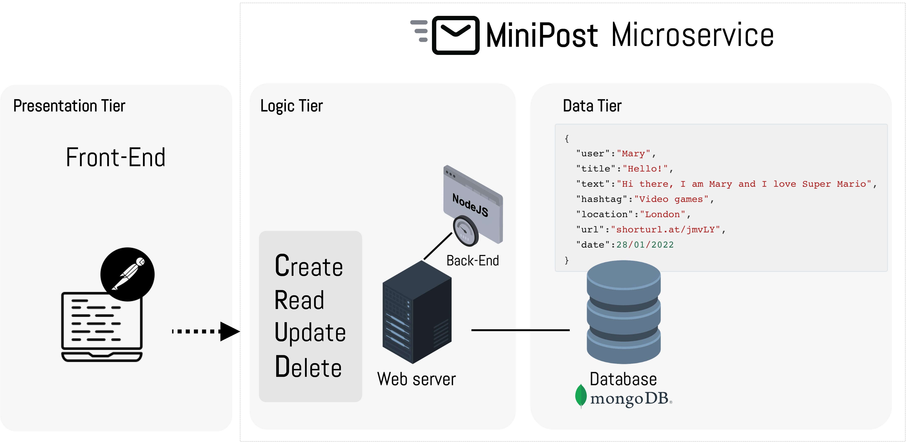

### Lab3.1: Building the MiniPost REST microservice

#### What am I about to learn?

Today's lab session focused on how to build a MiniPost REST microservice with an API by connecting to a MongoDB database to collect data and render it to the browser.

Lab 3 focuses on how to:

* Conceptualise a REST API development for the CRUD operations:
  * **C**reate data
  * **R**ead data
  * **U**pdate data
  * **D**elete data

* Deploy a MongoDB instance on the MongoDB Atlas
* Create a MiniPost REST API using Node.js

The following image demonstrates the MiniPost microservice architecture.



#### Lab 3.1: Building the MiniPost application with MongoDB

You will need to watch the next video on how to install and run a Node.js app.

> Take your time, make sure you double-check the code and debug your code as you go.

1. Firstly, watch the following video.

[](https://youtu.be/CQAyWd-NlzA)

> You should run this tutorial on your personal computer :white_check_mark:

2. Here, you will find the commands and scripts that I created in this video. Assuming that you already installed NodeJS on your personal computer, and you are already in your project folder, you can initialise a NodeJS application using the following script.

```shell
$ npm init
```

> npm is the node package manager that gives us access to the online repository of Node. 

3. For this tutorial, we need to install the `express` package, the `nodemon` tool,  the `mongoose` driver to connect to the MongoDB cluster, the `body-parser` to parse body data as JSON objects, and the `dotenv` that allows you to separate secrets from your source code.

```shell
$ npm install express nodemon mongoose body-parser dotenv 
```

> You can install all packages at the same time using one command.

4. Make sure you edit the `package.json` and adapt the `scripts` key to the following value (as shown in the video).

```javascript
...
"scripts": {
  "start":"nodemon app.js"
}
```

5. You will need to create a new MongoDB collection using the MongoDB atlas. Watch the video on how to connect and deploy your first MongoDB cluster.

> [Link](https://www.mongodb.com/cloud/atlas/lp/try2?utm_source=google&utm_campaign=gs_emea_united_kingdom_search_core_brand_atlas_desktop&utm_term=mongodb%20atlas%20login&utm_medium=cpc_paid_search&utm_ad=e&utm_ad_campaign_id=12212624581&adgroup=115749705303&gclid=CjwKCAiA55mPBhBOEiwANmzoQrRYt9_LM38WefyAApthSkD3j0I_soqf9RiNSKQnr2YL9oaLhXJEEhoChb4QAvD_BwE) to connect to the MongoDB cluster.

6. This is an example of a data instance of the mongoose model that we use in this tutorial. The data is in JSON format.

```json
{
  "user":"Stelios",
  "title":"Hi!",
  "text":"Hi I am Stelioa and this is my first post!",
  "hashtag":"#VideoGaming",
  "location":"London",
  "url":"https://stelios.com",
  "date":"2022-01-23T10:10:10"
}
```

5. The next script is the code used in the `app.js` file.

```javascript
const express = require('express')
const app = express()

const mongoose =require('mongoose')
require('dotenv/config')

const bodyParser = require('body-parser')
const postsRoute = require('./routes/posts')

app.use(bodyParser.json())
app.use('/posts',postsRoute)

app.get('/', (req,res) =>{
    res.send('Homepage')
})

mongoose.connect(process.env.DB_CONNECTOR, ()=>{
    console.log('DB is now connected!')
})

app.listen(3000, ()=>{
    console.log('Server is up and running...')
})
```

6. We created a new model called `Post.js` inside the new `models` folder.

```javascript
const mongoose = require('mongoose')

const PostSchema = mongoose.Schema({
    user:{
        type:String,
        required:true
    },
    title:{
        type:String,
        required:true
    },
    text:{
        type:String,
        required:true
    },
    hashtag:{
        type:String,
        required:true
    },
    location:{
        type:String,
        required:true
    },
    url:{
        type:String,
        required:true
    },
    date:{
        type:Date,
        default:Date.now
    }
})

module.exports = mongoose.model('posts',PostSchema)
```

7. We created the `posts.js` file inside a new `routes` folder.

```javascript
const express =require('express')
const router = express.Router()

const Post = require('../models/Post')

// POST (Create data)
router.post('/',async(req,res)=>{
    //console.log(req.body)

    const postData = new Post({
        user:req.body.user,
        title:req.body.title,
        text:req.body.text,
        hashtag:req.body.hashtag,
        location:req.body.location,
        url:req.body.url
    })
    // try to insert...
    try{
        const postToSave = await postData.save()
        res.send(postToSave)
    }catch(err){
        res.send({message:err})
    }
})

// GET 1 (Read all)
router.get('/', async(req,res) =>{
    try{
        const getPosts = await Post.find().limit(10)
        res.send(getPosts)
    }catch(err){
        res.send({message:err})
    }
})

// GET 2 (Read by ID)
router.get('/:postId', async(req,res) =>{
    try{
        const getPostById = await Post.findById(req.params.postId)
        res.send(getPostById)
    }catch(err){
        res.send({message:err})
    }
})

// PATCH (Update)
router.patch('/:postId', async(req,res) =>{
    try{
        const updatePostById = await Post.updateOne(
            {_id:req.params.postId},
            {$set:{
                user:req.body.user,
                title:req.body.title,
                text:req.body.text,
                hashtag:req.body.hashtag,
                location:req.body.location,
                url:req.body.url
                }
            })
        res.send(updatePostById)
    }catch(err){
        res.send({message:err})
    }
})

// DELETE (Delete)
router.delete('/:postId',async(req,res)=>{
    try{
        const deletePostById = await Post.deleteOne({_id:req.params.postId})
        res.send(deletePostById)
    }catch(err){
        res.send({message:err})
    }
})

module.exports = router
```

8. You need to run the `npm start` to start the server.

```shell
$ npm start
```

9. Make sure you create a couple of extra routes and familiarise yourself with the NodeJS code.

:checkered_flag: Well done! You completed lab 3! 

Now create your own data schema and implement the CRUD operations in Node.js! :clap: